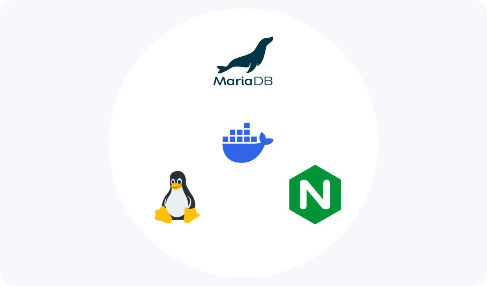
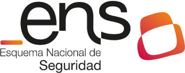

[Volver al índice general](../README.md)

# UD1 – Análisis del entorno y detección de necesidades tecnológicas

## Índice de apartados

- [ ] **1. Análisis del sector tecnológico**
- [ ] **2. Selección de la empresa o contexto de trabajo**
- [ ] **3. Identificación de necesidades tecnológicas**
- [ ] **4. Oportunidades y viabilidad del proyecto**
- [ ] **5. Obligaciones legales y normativas**
- [ ] **6. Guion inicial del proyecto**
- [ ] **Anexo: Documentación y Diagramas**

# Infraestructura de Alta Disponibilidad para E-Commerce Seguro (Dolbuck Secure Cloud)

---

### 1. Análisis del sector tecnológico

El sector TIC en Sevilla y su área metropolitana (especialmente en parques tecnológicos como Cartuja y PISA) está experimentando una transformación forzada por el aumento exponencial de ciberataques. Las PYMES andaluzas son un objetivo creciente del *Ransomware* debido a la debilidad de sus infraestructuras base y la falta de personal cualificado.

* **El Problema del Sector:** Muchas empresas locales delegan su presencia digital en proveedores de hosting masivo que carecen de medidas de seguridad ofensiva/defensiva, monitorización activa o alta disponibilidad real.
* **La Demanda Laboral:** Existe un déficit crítico de administradores de sistemas (perfil ASIR) capaces de diseñar arquitecturas de "Defensa en Profundidad". Las empresas buscan perfiles que no solo administren servidores, sino que sepan asegurarlos según el **Esquema Nacional de Seguridad (ENS)**.
* **Contexto Local:** El **Parque Industrial PISA** (Mairena del Aljarafe) concentra un alto número de empresas de servicios que demandan soluciones de **MSSP (Managed Security Service Provider)** para externalizar la seguridad de sus activos críticos.

### 2. Selección de la empresa o contexto de trabajo

El proyecto se enmarca dentro de la estructura de **Dolbuck**, una empresa real y consolidada en el sector de la seguridad informática en Sevilla.

* **Empresa:** **Dolbuck Ciberseguridad**.
* **Ubicación:** Calle Nobel nº 3, Edificio Logos 2, Parque Industrial PISA, 41927 Mairena del Aljarafe (Sevilla).
* **Actividad:** Servicios de Ciberseguridad, Auditoría de Hacking Ético, Informática Forense y formación especializada.
* **Contexto del Proyecto:**
    * Dolbuck requiere modernizar su propia infraestructura interna para ofrecer un nuevo servicio a sus clientes.
    * **Necesidad Detectada:** La empresa necesita desplegar una plataforma de **"Alojamiento Blindado"** (*Secure Hosting*).
    * **Objetivo:** Crear una infraestructura propia de **Alta Disponibilidad y Seguridad Bastionada** para hospedar aplicaciones críticas de clientes, garantizando que el servicio se mantenga online incluso bajo ataques.

### 3. Identificación de necesidades tecnológicas

Para ofrecer este servicio "Mejorado" de seguridad alineado con la marca Dolbuck, la infraestructura debe cumplir requisitos técnicos avanzados. Se han identificado las siguientes necesidades y soluciones curriculares:

| Necesidad Detectada | Solución Tecnológica Propuesta |
| :--- | :--- |
| **Protección contra ataques Web** (SQLi, XSS, DDoS) | **WAF (Web Application Firewall):** Implementación de reglas OWASP sobre un Proxy Inverso (Nginx + ModSecurity).
| **Continuidad de Negocio** (Caída de servidores) | **Cluster de Alta Disponibilidad:** Balanceadores de carga (HAProxy) y redundancia de nodos. 
| **Integridad de la Información** (Datos sensibles) | **BBDD Segura:** Servidor de Base de Datos aislado en red interna, con cifrado de datos en reposo.
| **Sistema Operativo Robusto** (Escalada de privilegios) | **Linux Hardening:** Uso de Linux (Rocky/Debian) con políticas estrictas (Sudo, SELinux, Auditoría).
| **Aislamiento de Entornos** (Seguridad lateral) | **Segmentación de Red:** Uso de VLANs y contenedores Docker para aislar clientes y laboratorios.

### 4. Oportunidades y viabilidad del proyecto

* **Oportunidad de Mercado:** Permite a Dolbuck diferenciar su oferta integrando la seguridad desde la capa de infraestructura ("Security by Design").
* **Viabilidad Técnica:** El proyecto es viable mediante **virtualización**. Se simulará el entorno utilizando un hipervisor (Proxmox o VirtualBox), permitiendo crear topologías de red complejas (DMZ, LAN, Gestión) sin coste de hardware físico adicional.
* **Viabilidad Económica:** Se utilizará un stack tecnológico  **100% Open Source** (Linux, Docker, MariaDB, PfSense). Esto maximiza el margen de beneficio, ya que el coste principal será la ingeniería (horas de técnico ASIR) y no las licencias de software propietario.

### 5. Obligaciones legales y normativas

Al tratarse de una empresa de ciberseguridad, el cumplimiento normativo es el pilar central. Se seguirá estrictamente lo establecido por el **Centro Criptológico Nacional (CCN)**:

1.  **Esquema Nacional de Seguridad (ENS):**
    * Se aplicará la **Metodología Eficiente de Adecuación (μCeENS)** para garantizar la conformidad del sistema.
    * El diseño se basará en el **Perfil de Cumplimiento Específico de Requisitos Fundamentales de Seguridad (PCE-RFS)**.
    * Se realizará un **Diagnóstico de Cumplimiento** previo a través del Portal de Gobernanza para evaluar la idoneidad del sistema.
2.  **Análisis de Riesgos:**
    * Conforme al **Anexo II del RD 311/2022** y validado mediante el **Módulo de Verificación (MVPCR)** para asegurar que las 38 medidas de seguridad mitigan los riesgos residuales.
    * Se establecerá un modelo de gobernanza que defina los roles de **Responsable de la Información, del Servicio y del Sistema**.
3.  **RGPD:** Implementación de cifrado en copias de seguridad y gestión de logs de acceso.

### 6. Guion inicial del proyecto

**Fase 1: Diseño y Red (SRI)**
* [ ] Diseño de la topología de red segura con firewall perimetral (PfSense).
* [ ] Creación de zonas de red: DMZ (pública), APP (privada) y DATA (blindada).

**Fase 2: Sistema Base y Bastionado (ASO)**
* [ ] Instalación de servidores Linux (Ubuntu Server / Rocky Linux).
* [ ] **Hardening:** Configuración de SSH seguro, Fail2Ban y auditoría de sistema.

**Fase 3: Servicios y Aplicaciones (IAW/ASGBD)**
* [ ] Despliegue de la pila web con contenedores (Docker).
* [ ] Implementación del SGBD (MariaDB) con replicación Maestro-Esclavo.

**Fase 4: Seguridad Ofensiva/Defensiva (SAD)**
* [ ] Configuración del WAF (Web Application Firewall) y detección de intrusos (IDS).
* [ ] Pruebas de estrés y simulación de ataques para validar la disponibilidad.

**Fase 5: Documentación y Planes (IPE II)**
* [ ] Elaboración de la Política de Seguridad y Declaración de Aplicabilidad.
* [ ] Plan de Adecuación y Continuidad de Negocio.

---

## Enlaces a recursos de la unidad

* [Documentos de la unidad](./documentos/) 
* [Diagramas e imágenes](./img/)

## Bibliografía / Webgrafía

**Normativa Técnica:**
* **Centro Criptológico Nacional (2025).**  [*CCN-STIC-890: Guía de Adecuación al ENS conforme al Perfil de Cumplimiento Específico de Requisitos Fundamentales de Seguridad*.](./documentos/CCN.pdf) . Secciones 3 y 4.

**Información Corporativa:**
* **Dolbuck Ciberseguridad.** *Sitio web corporativo y Aviso Legal*. Consultado en 2024. [https://dolbuck.net](https://dolbuck.net)

**Documentación Técnica:**
* Documentación oficial de **Docker**: [docs.docker.com](https://docs.docker.com)
* Guías de Bastionado **OWASP**: [owasp.org](https://owasp.org/www-project-wafcontrol/)
* --[Modsecurity](https://owasp.org/www-project-modsecurity/)
* OWASP Cheat Sheet Series. *Docker Security Cheat Sheet*. [https://cheatsheetseries.owasp.org](https://cheatsheetseries.owasp.org)
* Reglas de OWASP :[ModSecurity Core Rule Set](https://owasp.org/www-project-modsecurity-core-rule-set/)
* Analisis de Entorno: [sevillacityone.com](https://sevillacityone.com/la-provincia-de-sevilla-lidera-el-sector-tic-con-el-40-del-peso-andaluz/)
* Falta de Personal [Datacentermarket](https://www.datacentermarket.es/datacenter-infrastructure/las-contrataciones-tic-caen-un-28-en-dos-anos-pese-a-la-creciente-demanda/)
--[Itreseller](https://www.itreseller.es/al-dia/2024/09/el-73-de-las-empresas-tic-tiene-problemas-para-contratar-personal-cualificado)
* Ransomware  [https://www.incibe.es](https://www.incibe.es/empresas/tematicas/ransomware)
--[https://www.incibe.es/Ataques](https://www.incibe.es/incibe-cert/publicaciones/bitacora-de-seguridad/ciberataque-ransomware-contra-ayesa)

